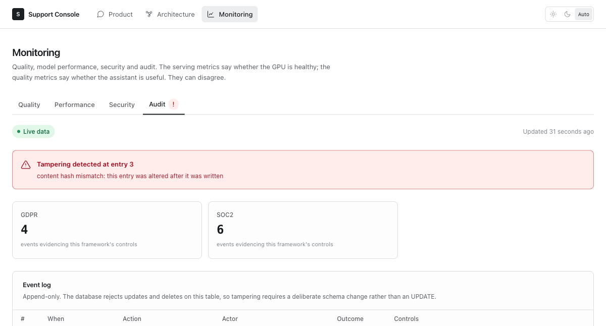
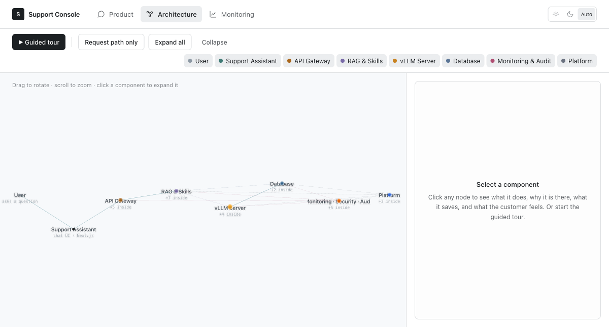
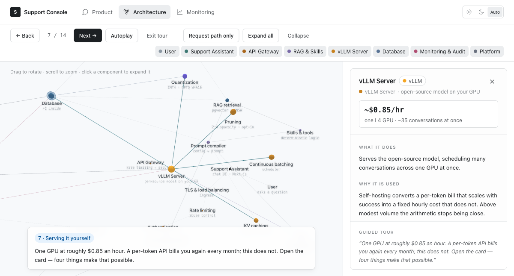
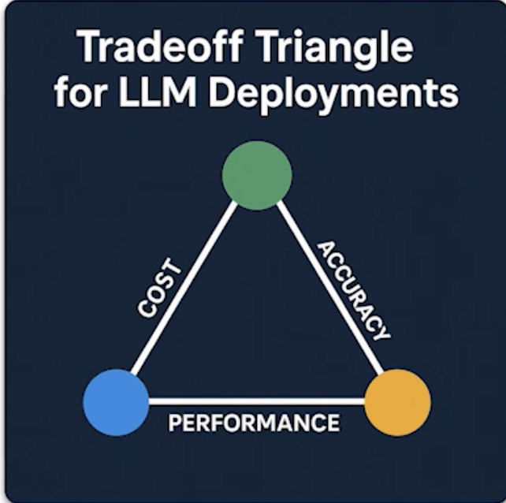
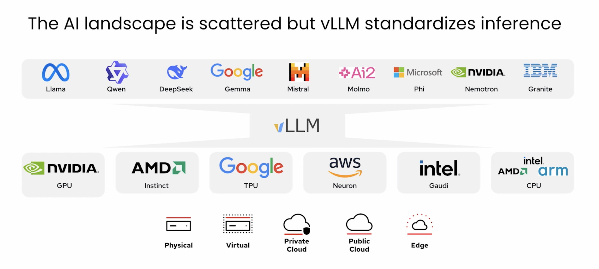

# Customer Support Assistant on vLLM

## If some of this sounds familiar

**The demo worked. The system never shipped.** A notebook answered five questions
beautifully in a meeting, everyone agreed it was impressive, and months later
there is still nothing a customer can reach. The distance between a prompt that
works once and a system that works at 3am under load is the entire project — and
almost none of it is the model.

**The bill arrives before the value does.** Per-token pricing looks negligible in
a pilot and stops looking negligible the moment the pilot succeeds. The invoice
scales with precisely the thing you were trying to grow, so the reward for
adoption is a bigger monthly cost. Meanwhile the model gets deprecated on
someone else's schedule, the price changes on someone else's schedule, and every
customer question is processed on someone else's servers.

**It falls over exactly when it matters.** The launch email goes out, traffic
arrives in a burst, and requests start timing out. The autoscaler does not fire,
because a saturated GPU sits at 30% CPU while latency climbs — so every
infrastructure dashboard is green while the product is unusable. Nobody can tell
whether it is slow, broken, or answering badly, because nothing measures the
difference.

**Nobody can say why it answered that.** A customer was told the wrong returns
window. Which prompt was live at 14:32? Who changed it, and did anyone else
know? Which document did it read? The support lead cannot adjust a policy
without filing a ticket; an engineer edits a string in a branch and the first
anyone hears about it is a complaint. The prompt — the thing that *is* the
product's behaviour — lives everywhere and belongs to no one.

---

This repository is one worked answer to those four problems, built as a real
system rather than a slide.

A retrieval-grounded customer support assistant: Qwen2.5-7B-Instruct compressed
to INT4, served by vLLM with paged KV cache and continuous batching, behind a
Next.js console where an operator — not an engineer — sets the company name,
brand voice and policies, sees exactly what the model will receive before
saving, and the answers actually change to match.

Deployed to GKE with Terraform, autoscaled on **GPU queue depth rather than
CPU**, and instrumented so you can tell the difference between "the GPU is
healthy" and "the assistant is useful". Every configuration change is an
immutable version with an author and a timestamp; every answer is recorded
against the version that produced it; every action lands in a hash-chained audit
log that can prove it has not been edited since.

The costs are fixed and stated: roughly $0.85/hour for one L4 serving about 35
concurrent conversations. Nothing here is billed per token, and nothing about
your customers leaves your own infrastructure.

| The problem | Where this repo answers it |
|---|---|
| A demo that never becomes a system | A running stack: `make dev`, three tabs, tests, CI, Terraform, Helm |
| A bill that grows with success | Self-hosted INT4 on one commodity GPU — [fixed hourly cost](#the-idea-that-shapes-everything-else) |
| Falls over under load | [Autoscaling on the signal that actually saturates](#autoscaling-on-the-right-signal), plus load tests |
| Nobody knows what changed, or why it said that | [Immutable config versions](#how-configuration-becomes-behaviour), citations on every answer, [hash-chained audit log](#monitoring) |

---

## The idea that shapes everything else

For support chat, the expensive part is prefill, and **nearly every request
shares the same prefix**: the compiled company system prompt.

vLLM caches KV blocks by token prefix. Two requests share cached computation for
exactly as long as their token sequences are identical, and diverge permanently
at the first differing token. So the prompt is assembled in one specific order:

```
1. compiled system prompt   identical for every request  -> always cache hit
2. retrieved context        varies per question           -> diverges here
3. conversation history     varies per conversation
4. current user turn        most volatile, always last
```

That is ~600 tokens of prefill that every concurrent conversation gets for free.
Putting retrieval first, or injecting a timestamp or customer name into the
system prompt, would move divergence to token ~1 and cost the entire cache.

This is why the prompt compiler is deterministic, why config versions are
immutable and materialised, and why history is trimmed by dropping whole turns
rather than summarising them. `backend/tests/test_assembler.py` asserts the
ordering so a refactor cannot quietly reverse it.

---

## Architecture

```
Browser
  │  never sees the model endpoint or any credential
  ▼
Next.js 16 console ── route handlers proxy server-side, SSE passthrough
  │
  ▼
FastAPI gateway ──── asyncpg ────► Postgres 16 + pgvector
  │                                 config versions, documents,
  │                                 chunks + embeddings, conversations
  ├── OpenAI-compatible HTTP ─────► vLLM · Qwen2.5-7B-Instruct W4A16 · L4
  └── OpenAI-compatible HTTP ─────► embeddings · bge-small-en-v1.5 · CPU
```

**Why a gateway instead of calling vLLM from Next.js.** Prompt compilation,
retrieval, guardrails, token accounting and PII redaction all belong in one
auditable place, and the model endpoint must never be reachable from the
internet. A NetworkPolicy restricts vLLM to backend pods only — bypassing the
gateway would bypass every guardrail with it.

**Why embeddings run on CPU.** Ingesting a 200-page policy PDF is a burst of
hundreds of embedding calls. On the serving GPU that would evict KV cache blocks
and spike latency for every customer mid-conversation.

---

## Repository layout

| Path | What it is |
|---|---|
| `model/` | INT4 compression pipeline and the quality gate that blocks bad artifacts |
| `serving/` | vLLM image and the tuned entrypoint (all serving knobs in one file) |
| `backend/` | FastAPI gateway — prompt compiler, retrieval, guardrails, audit, metrics |
| `frontend/` | Next.js console — Product, Architecture and Monitoring tabs |
| `deploy/helm/` | Charts for vllm, backend, frontend, embeddings |
| `infra/terraform/` | GCP modules plus `envs/dev` and `envs/prod` |
| `observability/` | Grafana dashboards, alert rules, prometheus-adapter config |
| `load-test/` | k6 scenarios that produce the tuning numbers |
| `prompts/` | Briefs for rebuilding this shape on six other frameworks (markdown + PDF) |

---

## The console

Three tabs, built to be demonstrated rather than only operated.

**Product** — the working assistant: streaming chat with verifiable citations,
plus Configuration and Knowledge Base as sub-views.

**Architecture** — an **expandable** 3D force graph laid out as the request
pipeline, in the order a question actually travels:

```
User → Support Assistant → API Gateway → RAG & Skills → vLLM Server
     → Database → Monitoring · Security · Audit          (Platform underneath)
```

It opens as eight cards, not thirty nodes. Click one and it unfolds in place
while the camera pulls back to frame its contents and a panel answers four
questions: what it does, why it is there, what it saves the buyer, and what the
customer feels.

The click the demo is built around is **vLLM Server**, which expands into the
four things that make one cheap GPU enough — KV caching, quantization, pruning
and continuous batching — each with its own short cost and quality argument.

Only one axis is pinned, and only for the eight stages, so the pipeline reads in
order while height and depth stay free. Pinning two axes was tried and reverted:
it produced a flowchart that happened to be rendered in WebGL.

Two details make it work rather than merely look impressive. Collapsed parents
render a visible wireframe shell and a `+N inside` label, so expandability is
obvious before anyone clicks. And all prose is HTML rather than WebGL text,
because cost figures drawn into the scene are unreadable once a video is
compressed — the scene carries structure, the panel carries meaning.

A guided tour walks fourteen stops in narrative order, expanding whatever it needs
to reach, with the presenter's line on screen and `←`/`→` to advance.

It is entirely static data and **renders with the backend stopped**, so a demo
can never fail because a GPU is cold.

**Monitoring** — quality, performance, security and audit. Reads Prometheus when
`PROMETHEUS_URL` is set and reachable; otherwise serves a deterministic seeded
dataset and says so with a badge driven by the API's own `source` field. The tab
never presents synthetic numbers as live ones.

The audit section is the one to show a compliance-minded buyer. It verifies the
hash chain on every request rather than caching a verdict — edit a row directly
in the database and it names the entry:



Reproduce it against a running stack: the `audit_events` table rejects `UPDATE`
and `DELETE` outright, so tampering first requires disabling the trigger — which
is itself the point.

```sql
ALTER TABLE audit_events DISABLE TRIGGER audit_events_no_update_delete;
UPDATE audit_events SET actor = 'attacker@evil.example' WHERE sequence = 3;
ALTER TABLE audit_events ENABLE TRIGGER audit_events_no_update_delete;
```

```bash
cd frontend && npm install && npm run dev    # http://localhost:3000
```



Clicking the vLLM card expands it into the techniques that pay for it:



Pruning is shown as **opt-in rather than active**, deliberately. The SparseGPT
2:4 recipe is wired and ready in `model/recipes/w4a16_sparse24.yaml`, but one-shot
2:4 on a 7B costs real quality — and it costs it in instruction following and
faithfulness to retrieved policy, which is exactly where a support assistant
cannot afford it. Claiming it as shipped is the kind of overstatement a technical
buyer checks and finds.

---

## Quick start

You need a Linux machine with an NVIDIA GPU (24 GB is enough) and Docker with
the NVIDIA container runtime.

```bash
cp .env.example .env          # review it — VLLM_BASE_URL can point at a remote GPU box

# 1. Compress the model (~30-60 min on one L4/A10)
make calibration
make quantize
make evaluate                 # quality gate — the artifact does not ship if this fails

# 2. Bring up the stack
make dev                      # postgres + embeddings + vllm + backend + frontend
make seed                     # demo company config and sample knowledge base

# 3. Open http://localhost:3000
```

Developing from a machine without a GPU: point `VLLM_BASE_URL` at your GPU box
and run `make dev-no-gpu`.

---

## The compression pipeline

`Qwen/Qwen2.5-7B-Instruct` → INT4 `compressed-tensors` via GPTQ.

| | bf16 | **W4A16 (shipped)** | FP8 W8A8 |
|---|---|---|---|
| Weights | ~15.2 GB | **~5.5 GB** | ~8.0 GB |
| KV cache left on a 24 GB L4 | does not fit | **~16 GB** | ~13 GB |
| Minimum GPU | A100 40 GB | **L4 24 GB** | L40S / H100 |

The memory freed by 4-bit weights is not the goal in itself — it becomes KV
cache, and KV cache determines how many conversations vLLM can hold in flight at
once. Qwen2.5-7B costs 56 KiB per token of KV at fp16 (28 layers × 4 GQA KV
heads × 128 dim × 2 for K+V × 2 bytes), so ~16 GB is roughly 290,000 tokens —
about 35 concurrent 8K-context conversations, versus not fitting at all.

Calibration uses support-domain text rather than generic web text, because GPTQ
picks quantization scales by minimising error on the tokens it sees. Pointing
`--local-dir` at your own policy documents is the highest-leverage option here:
those tokens appear in every production prompt.

**The quality gate** (`model/evaluate.py`) measures two different things.
Academic benchmarks (`ifeval`, `arc_challenge`, `gsm8k`) catch capability damage
and are gated as a delta against FP16. A support behaviour suite is gated on
absolute floors, because some failures are unshippable regardless of the
baseline: does it answer from the supplied policy, does it escalate instead of
inventing a refund window, does it treat instructions embedded inside an
uploaded document as data rather than commands. Scoring is assertion-based and
generation is greedy — a gate that blocks releases has to give the same answer
twice.

**Pruning is opt-in.** `model/recipes/w4a16_sparse24.yaml` adds SparseGPT 2:4
sparsity. One-shot 2:4 on a 7B reliably costs quality exactly where a support
assistant can least afford it — instruction following and faithfulness to
retrieved text. Expect the gate to fail and plan a recovery finetune. The recipe
is ready when you want to spend that budget; it is not the default.

---

## How configuration becomes behaviour

The config console is the product surface. Four things make it trustworthy
rather than a black box:

**Versions are immutable.** Saving inserts a new row and moves a pointer.
Nothing is edited in place. Rollback is the same operation aimed at an older
row, and every conversation records which version answered it — so "did that
prompt change help?" is answerable.

**The compiled prompt is materialised.** Stored on the version row with a hash.
That gives cheap diffs, lets the console preview exactly what the model will
receive, and means a change to the compiler cannot silently alter the behaviour
of already-shipped versions.

**The preview is the real thing.** The pane on the right of the config page is
produced by the same compiler that runs on save. There is one implementation, so
preview cannot drift from reality.

**Some rules are code, not config.** Grounding, the escalation sentinel and the
prompt-injection defence are appended by `prompt_compiler.py` and cannot be
edited from the console. An operator misconfiguring the tone is a bad day; an
operator deleting "only answer from the provided context" is a model that
invents refund policies.

### Grounding, concretely

"The system will respond properly" is not something you can prompt your way to.
It is four layers:

1. **Compiled policy** — the operator's rules enter the system prompt.
2. **Pre-generation gate** — if retrieval found nothing above the relevance
   floor, the request escalates *without calling the model at all*. A model
   handed weakly-related text will find something plausible to say; not asking
   is more reliable than asking and hoping. This is the layer that matters most,
   because it is deterministic.
3. **Model sentinel** — the model emits `[[ESCALATE]]` when it cannot answer.
   The backend detects it mid-stream, suppresses it, and returns a structured
   handoff state. The customer never sees the marker.
4. **Post-generation check** — an answer stating a specific figure while citing
   nothing is flagged, surfaced in the UI, and counted on the dashboard.

Citations are checkable, not decorative: each `[n]` marker resolves to the exact
chunk the retriever supplied, and clicking it opens that text.

---

## Deploying

```bash
cd infra/terraform/envs/dev
cp terraform.tfvars.example terraform.tfvars    # fill in project_id, authorized_networks
cp backend.hcl.example backend.hcl              # state bucket

terraform init -backend-config=backend.hcl
terraform plan                                  # review before applying
terraform apply

eval "$(terraform output -raw get_credentials)"
```

Then push images and install the charts — `terraform output helm_values_hint`
prints the values you need (registry path, Cloud SQL connection name, the
service accounts to annotate for Workload Identity).

There are no service account keys anywhere in this system. Pods authenticate as
a Kubernetes service account bound to a Google service account through Workload
Identity, which removes the entire class of incident where a key ends up in an
image, a git history, or a log.

Other security posture: private GKE cluster with no external node IPs, Cloud SQL
on private IP only, NetworkPolicy restricting vLLM to backend pods, secrets in
Secret Manager, non-root containers with read-only root filesystems.

---

## Autoscaling on the right signal

vLLM scales on `vllm:num_requests_waiting`, not CPU.

A saturated vLLM replica is blocked on CUDA, not compute. Its CPU sits at 20-40%
while requests queue behind a full KV cache and p95 latency climbs. **A
CPU-target HPA in front of this workload never fires** — it is the most common
way an LLM serving tier ends up with autoscaling that looks configured and does
nothing.

`prometheus-adapter` exposes the queue-depth metric through the custom metrics
API. Verify the chain before trusting it:

```bash
kubectl describe hpa support-vllm -n support   # <unknown> means it is not scaling
```

Scaling behaviour is deliberately asymmetric — instant up, 10-minute stabilisation
down. A GPU replica takes minutes to become ready, so hesitating to add one
prolongs a backlog while removing one prematurely costs another cold start.

---

## Monitoring

Two dashboards, because they can disagree:

**Serving** — TTFT and inter-token latency percentiles, throughput, running vs
waiting requests, KV-cache utilisation, prefix-cache hit rate, preemptions.

**Product** — deflection rate, escalations broken down by reason, retrieval
relevance distribution, citation coverage, prompt token economics, active config
version.

A deployment can be green on every serving metric and useless: an empty
knowledge base produces a fast, idle GPU and an assistant that escalates
everything. Only the product dashboard shows that.

Thirteen alert rules ship in `observability/prometheus/alerts.yaml`, each with a
runbook line saying what to actually check. All PromQL — alerts and every
dashboard panel — is syntax-checked in CI, because a bad query renders as "No
data" rather than an error, which is indistinguishable from a quiet system.

---

## The improvement loop

Everything above describes an assistant that stays the same. This is the part
that compounds: judgements about answers become the training data for the next
version of the model.

**Collection is automatic.** Under every answer there is a thumbs control and a
note field; a "Compare two answers" mode answers one question twice under
different sampling settings and asks which is better. That comparison is the
signal worth having — asked to score one answer people disagree wildly, asked
which of two is better they largely agree — and it produces exactly the
`(prompt, chosen, rejected)` triple preference training consumes. Both sides get
identical retrieved context, so the judgement is about the model rather than
about which candidate got luckier documents. Which variant is which stays hidden
until after the choice.

Everything collected is PII-redacted on write, stamped with the config version
that produced it, and audited. That table is an export surface, and an export is
the easiest way for personal data to leave the building.

**Training is not automatic, deliberately.** A fine-tune that fires whenever
enough preferences accumulate is a way to ship a regression that nobody read the
data for. The loop stops at an export:

```bash
curl -s "$BACKEND/v1/feedback/export?limit=5000" > preferences.jsonl   # DPO JSONL
# read them — this is the step that catches a lopsided set before it becomes a model
python model/train_preferences.py \
    --base output/qwen2.5-7b-instruct-w4a16 \
    --preferences preferences.jsonl \
    --output output/adapters/support-dpo-v3
```

DPO rather than reward-model-plus-PPO: it optimises directly on preference pairs
with far less machinery to get wrong. LoRA rather than a full fine-tune: an
adapter is a few hundred MB, trains in hours on the same class of GPU that
serves, loads into vLLM at runtime, and rolling back is unloading a file.
`--min-pairs` refuses to train on fewer than 200 pairs, because DPO on a small
set produces a model with strong opinions about a handful of questions and worse
behaviour everywhere else.

### Nothing is promoted without beating what it replaces

The adapter then faces the same gate that blocks a bad quantization, on two axes
that genuinely come apart — a fine-tune can answer better *and* stream slower:

| Dimension | Question | Tool |
|---|---|---|
| **Quality** | Is it still smart? | `lm_eval` — ifeval, arc_challenge, gsm8k, plus a held-out support suite |
| **Performance** | Is it still fast and efficient? | `GuideLLM` — p95 TTFT, inter-token latency, tokens/sec |

```bash
python model/evaluate.py --candidate output/adapters/support-dpo-v3 \
    --baseline-file baseline/production.json \
    --benchmark-target http://localhost:8000
```

Thresholds live in `model/eval_thresholds.yaml`. Instruction following is held
tightest (1.5 points) because it is the one that actually predicts support
quality; p95 TTFT may not rise more than 20%; throughput may not drop more than
15%, since fewer tokens per second on the same GPU is directly a higher cost per
conversation. Inter-token latency has an absolute ceiling of 80ms — past that,
streaming stops reading as typing. The support suite is assertion-based rather
than LLM-judged, because a gate that blocks releases has to be deterministic.

Either axis failing exits non-zero and the artifact is not promoted. GuideLLM
runs against a **running vLLM server**, not an in-process engine: the number
that matters is what a user experiences through the real serving path, including
the scheduler, continuous batching and HTTP.

The Monitoring tab's **Improvement** panel is the scoreboard — approval rate,
preference pairs collected, challenger win rate, and how many judgements are
waiting for the next training run. It is the one panel that is **never seeded
with demo data**: every other section falls back to synthetic numbers when
Prometheus is absent and says so with a badge, but feedback is a claim about
what real people judged, and an empty loop is shown as empty.

---

## Verification

```bash
make test          # 104 backend tests + 72 frontend tests
make lint          # ruff, strict mypy, eslint, tsc
make e2e           # Playwright against the running stack
make check-observability
```

The audit chain is tested by tampering with it: entries are altered, deleted, and
re-hashed by a would-be attacker, and each corruption must be caught at the right
sequence number. The injection detector is tested equally hard in both
directions — known payloads must be flagged and ordinary customer phrasing like
*"please disregard my last message"* must not be.

The end-to-end check that actually matters:

1. Set a company name and a distinctive refund policy in the console. Watch the
   prompt preview update.
2. Upload a policy document in the knowledge base; wait for it to index.
3. Ask a question that policy answers → the response uses the company name,
   follows the policy, and shows a citation chip that opens the right passage.
4. Change the policy and save → a new version appears; ask again and the answer
   changes.
5. Ask something the documents do not cover → a handoff, not an invented answer.
6. Roll back to the previous version in History → prior behaviour returns.

---

## Current status

| Component | State |
|---|---|
| Compression pipeline + quality gate | Complete, not yet run on real hardware |
| vLLM serving image and tuning | Complete |
| Backend gateway | Complete — 104 tests, strict mypy clean |
| Audit log, injection detection, dashboard API | Complete — chain verified by test |
| Frontend console (3 tabs) | Complete — 72 tests, builds clean, verified in a browser |
| Terraform (dev + prod) | Complete — validates; not yet applied |
| Helm charts | Complete — lint, render and schema-validate |
| Dashboards and alerts | Complete — PromQL validated |
| k6 scenarios | Complete — awaiting a first real run |
| Framework prompt pack | Complete — 7 markdown briefs, 9 PDFs |

Everything that can be verified without a GPU or a GCP project has been. The
numbers in `load-test/README.md` are blank on purpose: they should be measured
on your hardware, not estimated here.

## Rebuilding this on other frameworks

`prompts/` holds copy-paste briefs for building the same shape against six other
runtimes, as markdown and PDF:

| Framework | Class | Project |
|---|---|---|
| TensorRT-LLM | GPU server | Interactive voice agent, sub-800 ms turn latency |
| SGLang | GPU server | Document and image analysis, structured extraction |
| llama.cpp | Mobile | Offline field assistant, fully on-device |
| ExecuTorch | Mobile | On-device face verification, consented 1:1 |
| ONNX Runtime | IoT / edge | Workplace safety tracking |
| LiteRT | IoT / edge | Drone infrastructure inspection |

`prompts/00-shared-requirements.md` carries the standing spec — three tabs, the
3D architecture graph, the component chain, compression with a quality gate,
hash-chained audit, Prometheus and Grafana.

It also carries a substitution rule, because applying this project's checklist
unmodified to a vision model produces nonsense: **KV cache, continuous batching
and prefix caching only exist where there is autoregressive token generation.**
The three vision projects name their real optimisation — INT8 quantization,
operator fusion, NPU delegation, pruning — in the same position rather than
inventing a KV cache they do not have.

```bash
./scripts/build-prompt-pdfs.sh    # needs pandoc + xelatex
```

Copy from the `.md` files, not the PDFs: LaTeX sets ligatures, so `fl` copies out
of a PDF as `fl`.

## Not in scope yet

- **Authentication.** The console is unauthenticated behind cluster ingress. Add
  IAP or an OIDC proxy before exposing it beyond an internal network — the
  operator identity plumbing (`X-Forwarded-Email`) is already wired through to
  config attribution, so it starts working as soon as something populates it.
- **Reranking.** Vector-only retrieval first. Measure, then decide whether a
  cross-encoder earns its latency.
- **Multi-tenancy.** Single workspace, single active configuration.

---

## Every choice here is a point on this triangle

<p align="center">
  
</p>

Nothing in this repository escapes it. The decisions are only interesting
because of what each one gave up:

| Decision | Bought | Paid with |
|---|---|---|
| INT4 W4A16 instead of fp16 | 5.5 GB of weights instead of 15.2 — a $0.85/hr L4 instead of a card several times the price | A small accuracy risk, which is why compression is gated against an uncompressed baseline rather than trusted |
| 2:4 pruning **left off** | Nothing — it ships disabled | Accepting a higher memory floor, because one-shot sparsity costs instruction-following, and that is the wrong thing for a support assistant to lose |
| 7B rather than 70B | One commodity GPU, and sub-second first tokens | Headroom on the hardest questions — which is what the escalation path is for |
| fp16 KV cache, not fp8 | Predictable p95 latency on the attention kernel | Roughly half the concurrency fp8 would allow on this card |
| Vector-only retrieval, no reranker | A retrieval step measured in single-digit milliseconds | Some precision a cross-encoder would recover, at latency not yet shown to be worth it |
| Escalating instead of guessing | Answers a customer can trust, and a deflection rate that means something | Deflection rate itself — every handoff is a conversation the assistant did not resolve |
| Self-hosting rather than an API | A fixed hourly cost that does not scale with success, and no customer data leaving your infrastructure | Operational work: a GPU to run, a model to update, a rollout to own |

The monitoring tab exists because this triangle is not a one-time decision. Cost
per conversation, p95 latency and answer quality are measured continuously and
side by side, so a change that improves one at the expense of another is visible
rather than discovered later by a customer.

---

## And none of it is locked to one vendor

<p align="center">
  
</p>

The choices on the triangle above are yours to re-make later, which is most of
why vLLM is the serving layer here. It is the same engine and the same
OpenAI-compatible API across the whole matrix:

- **Any open model.** Qwen today. Llama, DeepSeek, Gemma, Mistral, Phi, Granite
  and Nemotron are a `--model` flag and a re-run of the compression pipeline —
  not a rewrite. Nothing in `backend/` knows which model is behind the endpoint.
- **Any accelerator.** NVIDIA GPU here because an L4 is the cheapest thing that
  fits this workload. AMD Instinct, Google TPU, AWS Neuron, Intel Gaudi and
  plain CPU are all supported backends. The KV-cache arithmetic in
  `serving/entrypoint.sh` changes; nothing above it does.
- **Anywhere it has to run.** Physical, virtual, private cloud, public cloud or
  edge. The Terraform in `infra/` targets GCP because it had to target
  something — the container, the Helm chart and the autoscaling signal
  (`vllm:num_requests_waiting`) are not GCP-specific.

This matters commercially more than technically. Committing to a hosted API
means committing to one vendor's model, one vendor's pricing and one vendor's
deprecation schedule at the same time. Here those are three separate decisions,
each reversible on its own, and a GPU price change or a better open model next
quarter is a config change rather than a migration.
